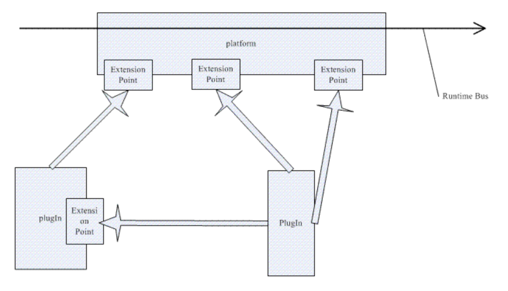
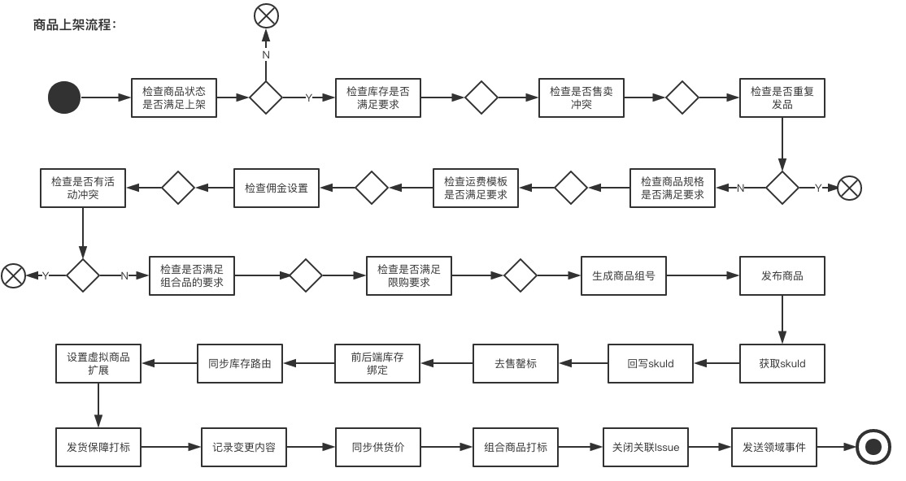
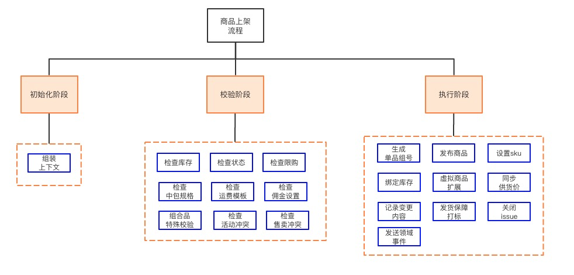
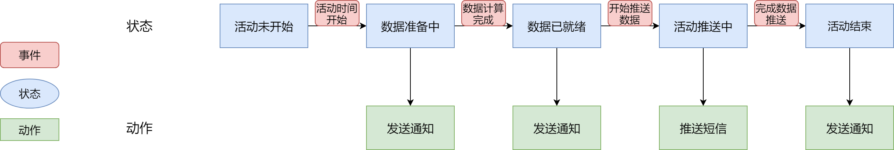
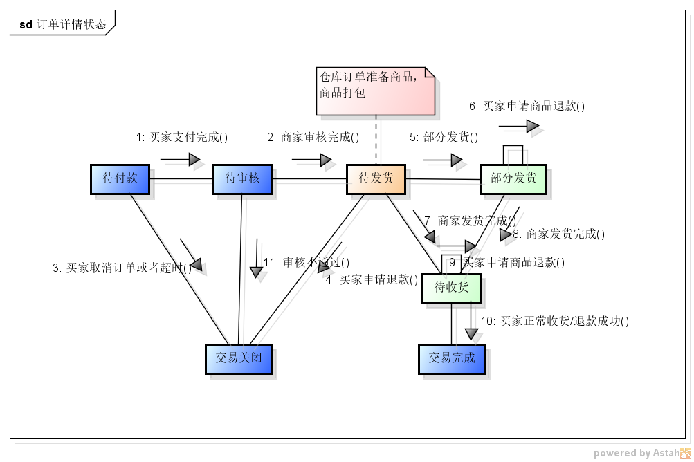
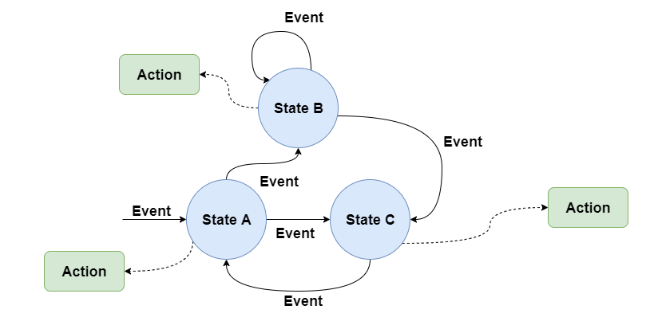
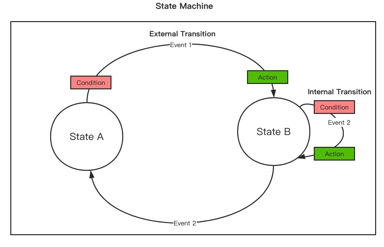
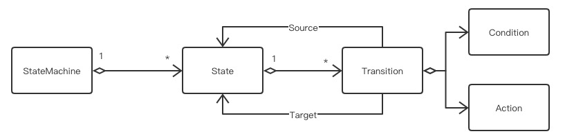
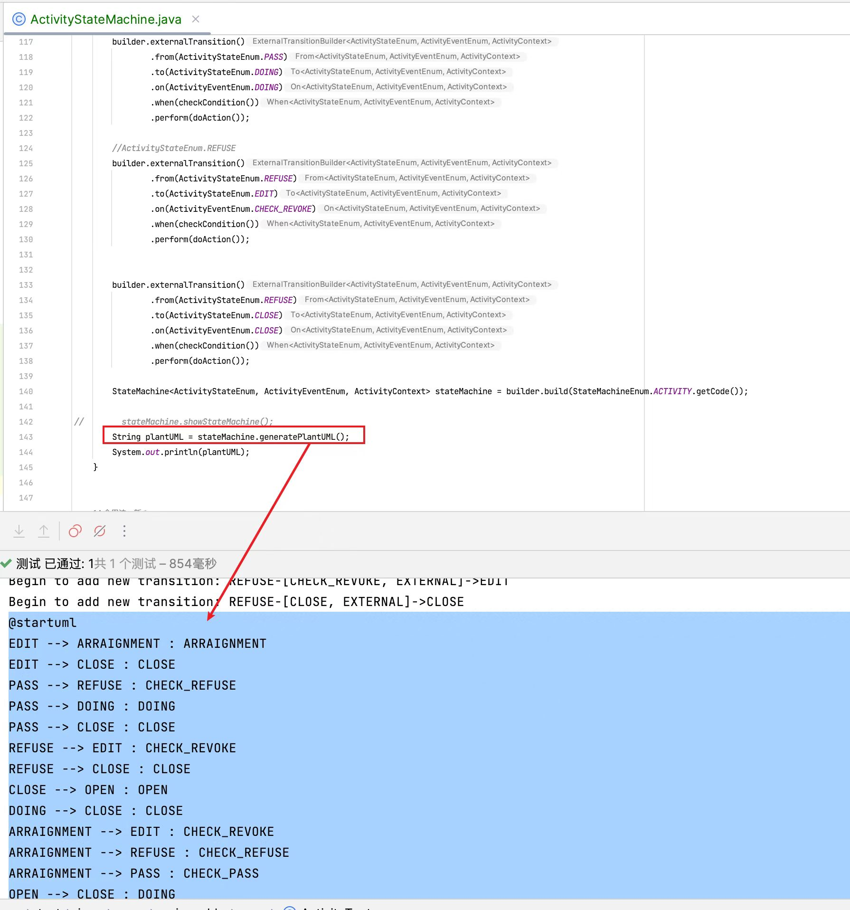
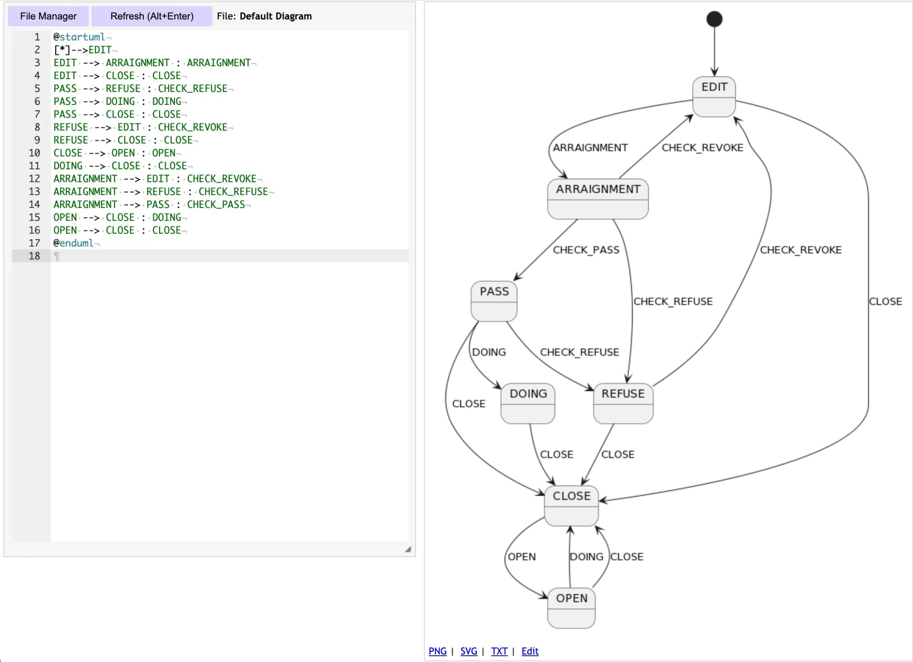

# 业务能力的扩展

扩展（Extension）是很多可扩展项目中一个关键的机制，可以利用扩展向平台添加新功能。但是扩展不能随意地创建，必须按照扩展点（Extension
Point）定义的规范进行明确的声明，平台才能识别出这些扩展。所谓扩展点，就是系统定义出来可以让你扩展的地方，可以认为是一些扩展的
**契约**，而扩展，这是你对这些扩展点的实现，当然你自己的插件也可以定义扩展点供别的开发人员扩展。



我们在思考扩展性时，很容易就可以想到使用策略模式

## 策略模式

### 何时使用策略模式

阿里开发规约-编程规约-控制语句-第六条 ：超过 3 层的 if-else 的逻辑判断代码可以使用卫语句、策略模式、状态模式等来实现。相信大家都见过这种代码：

```Java
if(conditionA){
        逻辑1
        }else if(conditionB){
        逻辑2
        }else if(conditionC){
        逻辑3
        }else{
        逻辑4
        }
```

这种代码虽然写起来简单，但是很明显违反了面向对象的 2 个基本原则：

- 单一职责原则（一个类应该只有一个发生变化的原因）：因为之后修改任何一个逻辑，当前类都会被修改

- 开闭原则（对扩展开放，对修改关闭）：如果此时需要添加（删除）某个逻辑，那么不可避免的要修改原来的代码

因为违反了以上两个原则，尤其是当 if-else
块中的代码量比较大时，后续代码的扩展和维护就会逐渐变得非常困难且容易出错，使用卫语句也同样避免不了以上两个问题。因此根据我的经验，得出一个我个人认为比较好的实践：

- if-else 不超过 2 层，块中代码 1~5 行，直接写到块中，否则封装为方法

- if-else 超过 2 层，但块中的代码不超过 3 行，尽量使用卫语句

- if-else 超过 2 层，且块中代码超过 3 行，尽量使用策略模式

### 如何使用策略模式

为了统一和简化大家使用策略模式，我们需要思考如何定义策略接口和路由具体策略实现进行封装。

其实设计模式的核心就在于，找出变化的部分，然后对变化进行抽象和封装，从而使得代码能够满足面向对象的基本原则。对于工厂方法模式来说，变化的是产品、工厂，因而我们可以先定义出抽象的策略(
产品)和策略(产品)工厂。

**定义策略接口**

```Java
public interface Strategy<T> {
    /**
     * 获得策略的标识
     */
    T getId();
}

```

每个策略必须实现 Strategy 接口，代表每个策略必须有一个唯一的标识。

**定义策略工厂**

```Java
public class StrategyFactory<T, S extends Strategy<T>>
        implements InitializingBean, ApplicationContextAware {
    private final Class<S> strategyType;
    private Map<T, S> strategyMap;
    private ApplicationContext appContext;
    /**
     * 创建一个策略工厂
     * 
     * @param strategyType 策略的类型
     */
    public StrategyFactory(Class<S> strategyType) {
        this.strategyType = strategyType;
    }
    /**
     * 根据策略 id 获得对应的策略的 Bean
     *
     * @param id 策略 id
     * @return 策略的 Bean
     */
    public S getStrategy(T id) {
        return strategyMap.get(id);
    }
    @Override
    public void afterPropertiesSet() {
        // 获取 Spring 容器中，所有 S 类型的 Bean
        Collection<S> strategies = appContext.getBeansOfType(strategyType).values();
        strategyMap = Maps.newHashMapWithExpectedSize(strategies.size());
        // 将 所有 S 类型的 Bean 放入到 strategyMap 中
        for (final S strategy : strategies) {
            T id = strategy.getId();
            strategyMap.put(id, strategy);
        }
    }
    @Override
    public void setApplicationContext(ApplicationContext applicationContext) throws BeansException {
        appContext = applicationContext;
    }
}

```

组合优于继承，在构造 StrategyFactory 必须设置当前工厂中的策略类型strategyType，具体策略工厂我们不需要再通过继承产生，我们可以直接通过配置进行组合即可

**以支付场景为例**

用户下单支付时，可以选择支付工具有微信支付、支付宝支付、钱包支付等等，不同的支付渠道对应着不同的实现方案。

首先，我们为支付客户端创建支付客户端接口，并继承Strategy接口

```Java
public interface IPaymentClient extends Strategy<String> {  
  
    String getPayChannel();  
  
    @Override  
    default String getId() {  
        return getPayChannel();  
    }  
  
    CreatePayOrderResponse pay(CreatePayOrderRequest createPayOrderRequest);  
  
}
```

实现支付宝支付客户端

```Java
@Component  
public class AliPaymentClient implements IPaymentClient {  
    protected final Logger log = LoggerFactory.getLogger(this.getClass());  
  
    @Override  
    public String getPayChannel() {  
        return PayChannelEnum.ALI_PAY.getCode();  
    }  
  
    @Override  
    public CreatePayOrderResponse pay(CreatePayOrderRequest createPayOrderRequest) {  
        log.info("AliPaymentClient.pay");  
        //todo支付宝支付下单逻辑
        return new CreatePayOrderResponse();  
    }  
}
```

实现微信支付客户端

```Java
@Component  
public class WechatPaymentClient implements IPaymentClient {  
    protected final Logger log = LoggerFactory.getLogger(this.getClass());  
  
    @Override  
    public String getPayChannel() {  
        return PayChannelEnum.WECHAT_PAY.getCode();  
    }  
  
  
    @Override  
    public CreatePayOrderResponse pay(CreatePayOrderRequest createPayOrderRequest) {  
        log.info("WechatPaymentClient.pay");  
        //todo支付宝支付下单逻辑
        return new CreatePayOrderResponse();  
    }  
}

```

通过配置组合策略工厂

```Java
@Configuration  
public class StrategyFactoryConfig {  
      
    @Bean  
    public StrategyFactory<String, IPaymentClient> paymentClientStrategyFactory() {  
        return new StrategyFactory(IPaymentClient.class);  
    }  
  
}
```

最后我们来测试一下

```Java
@Autowired  
private StrategyFactory<String, IPaymentClient> paymentClientStrategyFactory;  

/**  
 * 测试创建支付订单(策略模式)  
 */
 @Test  
public void testCreatePayOrderStrategy() {  
    CreatePayOrderRequest request = new CreatePayOrderRequest();  
    request.setUserId(1l);  
    request.setTradeNo("1");  
    request.setTotalFee(new BigDecimal("100"));  
    request.setPayChannel(PayChannelEnum.WECHAT_PAY.getCode());  
    paymentClientStrategyFactory.getStrategy(request.getPayChannel()).pay(request);  
}
```

## 扩展点

除了使用策略模式外，我们也可以通过基于扩展点注解的方式来实现对业务处理的路由。

Cola中提供了一种扩展点的机制，允许我们通过bizId（组织ID）、useCase（使用案例）、scenario（业务场景）三者动态的去选择实现类。有点类似于我们的策略模式，在程序运行的过程中，动态的选择实现类去处理我们的请求。

定义扩展点接口，实现ExtensionPointI

```Java
public interface IPaymentExtPt extends ExtensionPointI {  
    /**  
     * 发起交易执行的过程  
     *  
     * @param cmd  
     * @return  
     * @throws BizException  
     */  
    SingleResponse process(CreatePayOrderCmd cmd) throws BizException;  
  
  
    /**  
     * 完成交易结果的处理  
     *  
     * @param cmd  
     * @return  
     * @throws BizException  
     */  
    <D extends DTO> D completePayment(PaymentNotifyCmd cmd) throws BizException;  
  
}
```

支付宝支付扩展点实现

```Java
@Extension(bizId = BizScenarioConstant.BIZ_PAYMENT, useCase = BizScenarioConstant.USE_CASE_PAYMENT, scenario = BizScenarioConstant.SCENARIO_ALI_PAY)  
public class AliPaymentExt implements IPaymentExtPt {  
    protected final Logger log = LoggerFactory.getLogger(this.getClass());  
    @Resource  
    private PayOrderRepository payOrderRepository;  
  
    @Override  
    public SingleResponse process(CreatePayOrderCmd request) throws BizException { 
        //TODO：支付逻辑
        return SingleResponse.of(resultDTO);  
    }  
  
  
    @Override  
    public PaymentNotifyResponse completePayment(PaymentNotifyCmd cmd) throws BizException {  
        //TODO：完成支付逻辑
        return paymentNotifyResponse;  
    }  
}
```

微信支付扩展点实现

```Java
@Extension(bizId = BizScenarioConstant.BIZ_PAYMENT, useCase = BizScenarioConstant.USE_CASE_PAYMENT, scenario = BizScenarioConstant.SCENARIO_WECHAT_PAY)  
public class AliPaymentExt implements IPaymentExtPt {  
    protected final Logger log = LoggerFactory.getLogger(this.getClass());  
    @Resource  
    private PayOrderRepository payOrderRepository;  
  
    @Override  
    public SingleResponse process(CreatePayOrderCmd request) throws BizException { 
        //TODO：支付逻辑
        return SingleResponse.of(resultDTO);  
    }  
  
  
    @Override  
    public PaymentNotifyResponse completePayment(PaymentNotifyCmd cmd) throws BizException {  
        //TODO：完成支付逻辑
        return paymentNotifyResponse;  
    }  
}
```

扩展点使用

```Java
@Component  
public class CreatePayOrderCmdExe {  
    @Resource  
    private ExtensionExecutor extensionExecutor;  
  
    public SingleResponse execute(CreatePayOrderCmd cmd) {  
        return extensionExecutor.execute(IPaymentExtPt.class, cmd.getBizScenario(), ex -> ex.process(cmd));  
    }  
}
```

# 业务流程的编排

## 组合模式

**新零售商品上架场景**



**过程分解**

像这么复杂的业务场景，我们可以通过分而治之来分解问题。那如何分解问题和抽象问题？知道金字塔原理的应该知道，此处，我们可以使用结构化分解将问题解构成一个有层级的金字塔结构：



按照这种分解写的代码，就像一本书，目录和内容清晰明了。通过组合模式将流程分门别类组合起来

以商品上架为例，程序的入口是一个上架命令（OnSaleCommand）, 它由三个阶段（Phase）组成。

```Java
@Command
public class OnSaleNormalItemCmdExe {

    @Resource
    private OnSaleContextInitPhase onSaleContextInitPhase;
    @Resource
    private OnSaleDataCheckPhase onSaleDataCheckPhase;
    @Resource
    private OnSaleProcessPhase onSaleProcessPhase;

    @Override
    public Response execute(OnSaleNormalItemCmd cmd) {
        
        OnSaleContext onSaleContext = init(cmd);
        
        checkData(onSaleContext);

        process(onSaleContext);

        return Response.buildSuccess();
    }

    private OnSaleContext init(OnSaleNormalItemCmd cmd) {
        return onSaleContextInitPhase.init(cmd);
    }

    private void checkData(OnSaleContext onSaleContext) {
        onSaleDataCheckPhase.check(onSaleContext);
    }

    private void process(OnSaleContext onSaleContext) {
        onSaleProcessPhase.process(onSaleContext);
    }
}
```

每个Phase又可以拆解成多个步骤（Step），以`OnSaleProcessPhase`为例，它是由一系列Step组成的：

```Java
@Phase
public class OnSaleProcessPhase {

    @Resource
    private PublishOfferStep publishOfferStep;
    @Resource
    private BackOfferBindStep backOfferBindStep;
    //省略其它step

    public void process(OnSaleContext onSaleContext){
        SupplierItem supplierItem = onSaleContext.getSupplierItem();

        // 生成OfferGroupNo
        generateOfferGroupNo(supplierItem);
       
       // 发布商品
        publishOffer(supplierItem);

        // 前后端库存绑定 backoffer域
        bindBackOfferStock(supplierItem);

        // 同步库存路由 backoffer域
        syncStockRoute(supplierItem);

        // 设置虚拟商品拓展字段
        setVirtualProductExtension(supplierItem);

        // 发货保障打标 offer域
        markSendProtection(supplierItem);

        // 记录变更内容ChangeDetail
        recordChangeDetail(supplierItem);

        // 同步供货价到BackOffer
        syncSupplyPriceToBackOffer(supplierItem);

        // 如果是组合商品打标，写扩展信息
        setCombineProductExtension(supplierItem);

        // 去售罄标
        removeSellOutTag(offerId);

        // 发送领域事件
        fireDomainEvent(supplierItem);
        
        // 关闭关联的待办事项
        closeIssues(supplierItem);
    }
}
```

## 管道模式

todo

## 责任链模式

todo

## 流程引擎

todo

# 业务流程的抽象

## 模板模式

**模板模式（Template Pattern）** 又叫模板方法模式，其定义了操作的流程，并将流程中的某些步骤延迟到子类中进行实现，使得子类在不改变操作流程的前提下，即可重新定义该操作的某些特定步骤。例如做菜，操作流程一般为
“准备菜”->“放油”->“炒菜”->“调味”->“装盘”，但可能对于不同的菜要放不同类型的油，不同的菜调味方式也可能不一样。

### 何时使用模板模式

当一个操作的流程较为复杂，可分为多个步骤，且对于不同的操作实现类，流程步骤相同，只有部分特定步骤才需要自定义，此时可以考虑使用模板模式。如果一个操作不复杂（即只有一个步骤），或者不存在相同的流程，那么应该使用策略模式。从这也可看出模板模式和策略模式的区别：策略模式关注的是多种策略（广度），而模板模式只关注同种策略（相同流程），但是具备多个步骤，且特定步骤可自定义（深度）。

### 如何使用模板模式

还是以支付场景举例，支付实现流程包括：校验参数→组装支付SDK所需参数→调用SDK执行支付→后置处理→返回支付结果。

**首先，定义出支付模板**

```Java
public abstract class AbstractPaymentExt<T extends Context> implements IPaymentExtPt {
    protected final Logger log = LoggerFactory.getLogger(this.getClass());

    /**
     * 获取验证器
     *
     * @return
     */
    public abstract Validator getValidator();


    /**
     * 创建上下文信息
     *
     * @param cmd
     * @return
     */
    public abstract T createContext(CreatePayOrderCmd cmd);


    /**
     * 为下层的支付渠道的数据做好准备
     *
     * @param cmd
     * @param context
     * @throws BizException
     */
    public void prepare(CreatePayOrderCmd cmd, T context) throws BizException {
        SortedMap<String, Object> sParaTemp = new TreeMap<String, Object>();
        context.setsParaTemp(sParaTemp);
    }


    /**
     * 基本业务处理
     *
     * @param request
     * @param context
     * @return AbstractResponse
     * @throws BizException
     */
    public abstract SingleResponse generalProcess(CreatePayOrderCmd request, T context) throws BizException;

    /***
     * 基本业务处理完成后执行的后续操作
     * @param cmd
     * @param response
     * @param context
     * @return
     * @throws BizException
     */
    public abstract void afterProcess(CreatePayOrderCmd cmd, SingleResponse response, T context) throws BizException;


    @Override
    public SingleResponse process(CreatePayOrderCmd cmd) throws BizException {
        log.info("Begin AbstractPaymentExt.process:{}", JSON.toJSONString(cmd));
        SingleResponse response = null;
        //创建上下文
        T context = createContext(cmd);
        //验证
        getValidator().validate(cmd);
        //准备
        prepare(cmd, context);
        //执行
        response = generalProcess(cmd, context);
        //善后
        afterProcess(cmd, response, context);
        return response;
    }


}
```

**中介者模式**（Mediator
Pattern）是用来降低多个对象和类之间的通信复杂性。这种模式提供了一个中介类，就像我们在网络通信链路中传递的一个数据包，该类通常处理不同类之间的通信，并支持松耦合，使代码易于维护。中介者模式属于行为型模式。

**业务流程执行过程中，需要传递上下文对象，用来降低多个对象和类之间的通信复杂性**

```Java
public class Context {

    SortedMap<String, Object> sParaTemp;

    public Context() {
        super();
    }

    public SortedMap<String, Object> getsParaTemp() {
        return sParaTemp;
    }

    public void setsParaTemp(SortedMap<String, Object> sParaTemp) {
        this.sParaTemp = sParaTemp;
    }
}
```

**实现支付宝支付**

```Java
@Extension(bizId = BizScenarioConstant.BIZ_PAYMENT, useCase = BizScenarioConstant.USE_CASE_PAYMENT, scenario = BizScenarioConstant.SCENARIO_ALI_PAY)
public class AliPaymentExt extends AbstractPaymentExt<AliPaymentContext> implements IPaymentExtPt {
    protected final Logger log = LoggerFactory.getLogger(this.getClass());
    @Resource
    private CreateAliPayOrderValidator validator;
    @Resource
    private PayOrderRepository payOrderRepository;

    @Override
    public Validator getValidator() {
        return validator;
    }

    @Override
    public AliPaymentContext createContext(CreatePayOrderCmd cmd) {
        log.info("Begin AliPaymentExt.createContext");
        AliPaymentContext aliPaymentContext = new AliPaymentContext();
        //组装上下文
        return aliPaymentContext;
    }

    @CatchAndLog
    @Override
    public void prepare(CreatePayOrderCmd cmd, AliPaymentContext context) throws BizException {
        log.info("Begin AliPaymentExt.prepare");
        super.prepare(cmd, context);
        //构建微信支付接口请求体


    }

    @Override
    public SingleResponse generalProcess(CreatePayOrderCmd request, AliPaymentContext context) throws BizException {
        log.info("Begin AliPaymentExt.generalProcess");
        PayOrderCreateResultDTO resultDTO = new PayOrderCreateResultDTO();
        //请求微信支付接口
        //将响应结果存储到上下文context
        //组装返回结果
        return SingleResponse.of(resultDTO);
    }

    @Override
    public void afterProcess(CreatePayOrderCmd cmd, SingleResponse response, AliPaymentContext context) throws BizException {
        log.info("Begin AliPaymentExt.afterProcess");
        //插入支付表
    }

    @Override
    public PaymentNotifyResponse completePayment(PaymentNotifyCmd cmd) throws BizException {
        log.info("Begin AliPaymentExt.completePayment");
        PaymentNotifyResponse paymentNotifyResponse = new PaymentNotifyResponse();
        //验证签名
        //组装返回结果
        //更新支付订单状态
        //更新商品订单状态
        return paymentNotifyResponse;
    }
}
```

**实现微信支付**

```Java
@Extension(bizId = BizScenarioConstant.BIZ_PAYMENT, useCase = BizScenarioConstant.USE_CASE_PAYMENT, scenario = BizScenarioConstant.SCENARIO_WECHAT_PAY)
public class WechatPaymentExt extends AbstractPaymentExt<WechatPaymentContext> implements IPaymentExtPt {
    protected final Logger log = LoggerFactory.getLogger(this.getClass());
    @Resource
    private CreateWechatPayOrderValidator validator;

    @Resource
    private PayOrderRepository payOrderRepository;

    @Override
    public Validator getValidator() {
        return validator;
    }

    @Override
    public WechatPaymentContext createContext(CreatePayOrderCmd cmd) {
        log.info("Begin WechatPaymentExt.createContext");
        WechatPaymentContext wechatPaymentContext = new WechatPaymentContext();
        //组装上下文
        return wechatPaymentContext;
    }

    @Override
    public void prepare(CreatePayOrderCmd cmd, WechatPaymentContext context) throws BizException {
        log.info("Begin WechatPaymentExt.prepare");
        super.prepare(cmd, context);
        //构建微信支付接口请求体


    }

    @Override
    public SingleResponse generalProcess(CreatePayOrderCmd request, WechatPaymentContext context) throws BizException {
        log.info("Begin WechatPaymentExt.generalProcess");
        PayOrderCreateResultDTO resultDTO = new PayOrderCreateResultDTO();
        //请求微信支付接口
        //将响应结果存储到上下文context
        //组装返回结果
        return SingleResponse.of(resultDTO);
    }

    @Override
    public void afterProcess(CreatePayOrderCmd cmd, SingleResponse response, WechatPaymentContext context) throws BizException {
        log.info("Begin WechatPaymentExt.afterProcess");
        //插入支付表
    }

    @Override
    public PaymentNotifyResponse completePayment(PaymentNotifyCmd cmd) throws BizException {
        log.info("Begin WechatPaymentExt.completePayment");
        PaymentNotifyResponse paymentNotifyResponse = new PaymentNotifyResponse();
        //验证签名
        //组装返回结果
        //更新支付订单状态
        //更新商品订单状态
        return paymentNotifyResponse;
    }
}
```

**以上我们综合了扩展点+模板模式+中介者模式，最后来使用它们测试一下**

```Java
@Component
public class CreatePayOrderCmdExe {
    @Resource
    private ExtensionExecutor extensionExecutor;

    public SingleResponse execute(CreatePayOrderCmd cmd) {
        return extensionExecutor.execute(IPaymentExtPt.class, cmd.getBizScenario(), ex -> ex.process(cmd));
    }
}


@RunWith(SpringRunner.class)
@SpringBootTest
public class PaymentExecutorTest {

    @Autowired
    private CreatePayOrderCmdExe createPayOrderCmdExe;


    @Test
    public void testCreatePayOrderCmdExe() {
        CreatePayOrderCmd cmd = new CreatePayOrderCmd();
        cmd.setUserId(1L);
        cmd.setTradeNo("1");
        cmd.setTotalFee(new BigDecimal("100"));
        cmd.setOrderFee(new BigDecimal("100"));
        cmd.setSubject("subject");
        cmd.setSpbillCreateIp("127.0.0.1");
        cmd.setPayChannel(PayChannelEnum.ALI_PAY.getCode());
        cmd.setAddressId(1L);
        SingleResponse response = createPayOrderCmdExe.execute(cmd);
    }


}

```

# 业务状态的流转

在开发过程中我们时常需要对程序的不同状态进行切换以及产生不同的行为，通常我们可以使用 if… else
语句来做状态判断处理不同的情况。但是每次新增或者修改状态，if else
语句就要相应的的增多或者修改，这样不仅违反了开放封闭原则，而且状态的切换非常不明显，代码的可读性和扩展性比较差，不易于维护。

**短信活动状态转移场景**



**商品订单状态流转场景**



**状态机定义**：

有限状态机（Finite-State Machine , 缩写：FSM），简称状态机。是表示有限个状态以及这些状态之间的转移和触发动作的模型。

- 状态是描述系统对象在某个时刻所处的状况。

- 转移指示状态变更，一般是通过外部事件为条件触发状态的转移。

- 动作是对给定状态下要进行的操作。

简而言之，状态机是由事件、状态、动作三大部分组成。三者的关系是：事件触发状态的转移，状态的转移触发后续动作的执行。其中动作不是必须的，也可以只进行状态转移，不进行任何操作。



## 基于状态模式实现的状态机

**以活动审核场景为例**

活动状态有【1编辑、2提审、3撤审、4通过、5运行(审核通过后worker扫描状态)、6拒绝、7关闭、8开启】

```Java
public enum ActivityStateEnum implements IEnum {

    /**
     * 1：编辑
     */
    EDIT("1", "编辑"),
    /**
     * 2：提审
     */
    ARRAIGNMENT("2", "提审"),
    /**
     * 3：撤审
     */
    REVOKE("3", "撤审"),
    /**
     * 4：通过
     */
    PASS("4", "通过"),
    /**
     * 5：运行(活动中)
     */
    DOING("5", "运行(活动中)"),
    /**
     * 6：拒绝
     */
    REFUSE("6", "拒绝"),
    /**
     * 7：关闭
     */
    CLOSE("7", "关闭"),
    /**
     * 8：开启
     */
    OPEN("8", "开启");;


    private String code;

    private String desc;

    ActivityStateEnum(String code, String desc) {
        this.code = code;
        this.desc = desc;
    }

    public String getCode() {
        return code;
    }

    public String getDesc() {
        return desc;
    }
}
```

活动审核过程中触发的动作事件有：【提审、审核通过，审核拒绝，撤销审核，关闭，开始，运行活动中】我们为这些事件处理定义接口

```Plain Text
public interface IActivityStateHandler {


    /**
     * 提审
     *
     * @param activityId    活动ID
     * @param currentStatus 当前状态
     * @return 审核结果
     */
    boolean arraignment(Long activityId, Enum<ActivityStateEnum> currentStatus);

    /**
     * 审核通过
     *
     * @param activityId    活动ID
     * @param currentStatus 当前状态
     * @return 审核结果
     */
    boolean checkPass(Long activityId, Enum<ActivityStateEnum> currentStatus);

    /**
     * 审核拒绝
     *
     * @param activityId    活动ID
     * @param currentStatus 当前状态
     * @return 审核结果
     */
    boolean checkRefuse(Long activityId, Enum<ActivityStateEnum> currentStatus);

    /**
     * 撤销审核
     *
     * @param activityId    活动ID
     * @param currentStatus 当前状态
     * @return 审核结果
     */
    boolean checkRevoke(Long activityId, Enum<ActivityStateEnum> currentStatus);

    /**
     * 关闭
     *
     * @param activityId    活动ID
     * @param currentStatus 当前状态
     * @return 审核结果
     */
    boolean close(Long activityId, Enum<ActivityStateEnum> currentStatus);

    /**
     * 开启
     *
     * @param activityId    活动ID
     * @param currentStatus 当前状态
     * @return 审核结果
     */
    boolean open(Long activityId, Enum<ActivityStateEnum> currentStatus);

    /**
     * 运行活动中
     *
     * @param activityId    活动ID
     * @param currentStatus 当前状态
     * @return 审核结果
     */
    boolean doing(Long activityId, Enum<ActivityStateEnum> currentStatus);

}
```

**首先，我们定义活动状态的抽象模板**

```Java
public abstract class AbstractActivityState {

    @Resource
    protected IActivityRepository IActivityRepository;

    public abstract ActivityStateEnum getState();

    public boolean arraignment(Long activityId, Enum<ActivityStateEnum> currentStatus) {
        throw ExceptionFactory.bizException("not support operation");
    }


    public boolean checkPass(Long activityId, Enum<ActivityStateEnum> currentStatus) {
        throw ExceptionFactory.bizException("not support operation");
    }


    public boolean checkRefuse(Long activityId, Enum<ActivityStateEnum> currentStatus) {
        throw ExceptionFactory.bizException("not support operation");
    }


    public boolean checkRevoke(Long activityId, Enum<ActivityStateEnum> currentStatus) {
        throw ExceptionFactory.bizException("not support operation");
    }


    public boolean close(Long activityId, Enum<ActivityStateEnum> currentStatus) {
        throw ExceptionFactory.bizException("not support operation");
    }


    public boolean open(Long activityId, Enum<ActivityStateEnum> currentStatus) {
        throw ExceptionFactory.bizException("not support operation");
    }


    public boolean doing(Long activityId, Enum<ActivityStateEnum> currentStatus) {
        throw ExceptionFactory.bizException("not support operation");
    }
}
```

**在不同状态下，对应的事件处理实现**

```Java
/**
 * @description: 编辑状态
 */
@Component
public class EditingActivityState extends AbstractActivityState {

    @Override
    public ActivityStateEnum getState() {
        return ActivityStateEnum.EDIT;
    }

    @Override
    public boolean arraignment(Long activityId, Enum<ActivityStateEnum> currentState) {
        return IActivityRepository.alterStatus(activityId, currentState, ActivityStateEnum.ARRAIGNMENT);
    }

    @Override
    public boolean close(Long activityId, Enum<ActivityStateEnum> currentState) {
        return IActivityRepository.alterStatus(activityId, currentState, ActivityStateEnum.CLOSE);
    }


/**
 * @description: 提审状态
 */
@Component
public class ArraignmentActivityState extends AbstractActivityState {

    @Override
    public ActivityStateEnum getState() {
        return ActivityStateEnum.ARRAIGNMENT;
    }

    @Override
    public boolean checkPass(Long activityId, Enum<ActivityStateEnum> currentState) {
        return IActivityRepository.alterStatus(activityId, currentState, ActivityStateEnum.PASS);

    }

    @Override
    public boolean checkRefuse(Long activityId, Enum<ActivityStateEnum> currentState) {
        return IActivityRepository.alterStatus(activityId, currentState, ActivityStateEnum.REFUSE);

    }

    @Override
    public boolean checkRevoke(Long activityId, Enum<ActivityStateEnum> currentState) {
        return IActivityRepository.alterStatus(activityId, currentState, ActivityStateEnum.EDIT);
    }


}


/**
 * @description: 审核通过状态
 */
@Component
public class PassActivityState extends AbstractActivityState {

    @Override
    public ActivityStateEnum getState() {
        return ActivityStateEnum.PASS;
    }

    @Override
    public boolean checkRefuse(Long activityId, Enum<ActivityStateEnum> currentState) {
        return IActivityRepository.alterStatus(activityId, currentState, ActivityStateEnum.REFUSE);

    }


    @Override
    public boolean close(Long activityId, Enum<ActivityStateEnum> currentState) {
        return IActivityRepository.alterStatus(activityId, currentState, ActivityStateEnum.CLOSE);

    }


    @Override
    public boolean doing(Long activityId, Enum<ActivityStateEnum> currentState) {
        return IActivityRepository.alterStatus(activityId, currentState, ActivityStateEnum.DOING);
    }

}

/**
 * @description: 审核拒绝状态
 */
@Component
public class RefuseActivityState extends AbstractActivityState {


    @Override
    public ActivityStateEnum getState() {
        return ActivityStateEnum.REFUSE;
    }

    @Override
    public boolean checkRevoke(Long activityId, Enum<ActivityStateEnum> currentState) {
        return IActivityRepository.alterStatus(activityId, currentState, ActivityStateEnum.EDIT);

    }

    @Override
    public boolean close(Long activityId, Enum<ActivityStateEnum> currentState) {
        return IActivityRepository.alterStatus(activityId, currentState, ActivityStateEnum.CLOSE);

    }


}

//省略其他状态实现....
```

**初始化配置所有活动状态处理器集合，并对每一种状态对应的状态处理器做映射**

```Java
public class ActivityStateConfig {
    /**
     * 活动状态对应的状态处理器映射
     */
    protected Map<ActivityStateEnum, AbstractActivityState> stateGroup = new ConcurrentHashMap<>();
    /**
     * 状态处理器集合
     */
    private List<AbstractActivityState> stateList;

    public ActivityStateConfig(List<AbstractActivityState> orderStateList) {
        this.stateList = orderStateList;
    }

    /**
     * 初始化活动状态处理器映射
     * @throws BizException
     */
    @PostConstruct
    public void init() throws BizException {
        for (AbstractActivityState activityState : stateList) {
            stateGroup.put(activityState.getState(), activityState);
        }
    }

    /**
     * 获取状态处理器
     * @param statusEnum
     * @return
     * @throws BizException
     */
    public AbstractActivityState getHandler(ActivityStateEnum statusEnum) throws BizException {
        if (!stateGroup.containsKey(statusEnum)) {
            throw ExceptionFactory.bizException("state handler not exist");
        }
        return stateGroup.get(statusEnum);
    }

}
```

**最后我们继承活动状态配置，并实现活动状态处理器接口，这里我们都根据当前状态从‘stateGroup’中获取当前状态处理器，并执行对应的处理
**

```Java
@Component
public class ActivityStateHandlerImpl extends ActivityStateConfig implements IActivityStateHandler {

    @Autowired
    public ActivityStateHandlerImpl(List<AbstractActivityState> orderStateList) {
        super(orderStateList);
    }

    @Override
    public boolean arraignment(Long activityId, Enum<ActivityStateEnum> currentStatus) {
        return stateGroup.get(currentStatus).arraignment(activityId, currentStatus);
    }

    @Override
    public boolean checkPass(Long activityId, Enum<ActivityStateEnum> currentStatus) {
        return stateGroup.get(currentStatus).checkPass(activityId, currentStatus);
    }

    @Override
    public boolean checkRefuse(Long activityId, Enum<ActivityStateEnum> currentStatus) {
        return stateGroup.get(currentStatus).checkRefuse(activityId, currentStatus);
    }

    @Override
    public boolean checkRevoke(Long activityId, Enum<ActivityStateEnum> currentStatus) {
        return stateGroup.get(currentStatus).checkRevoke(activityId, currentStatus);
    }

    @Override
    public boolean close(Long activityId, Enum<ActivityStateEnum> currentStatus) {
        return stateGroup.get(currentStatus).close(activityId, currentStatus);
    }

    @Override
    public boolean open(Long activityId, Enum<ActivityStateEnum> currentStatus) {
        return stateGroup.get(currentStatus).open(activityId, currentStatus);
    }

    @Override
    public boolean doing(Long activityId, Enum<ActivityStateEnum> currentStatus) {
        return stateGroup.get(currentStatus).doing(activityId, currentStatus);
    }
}
```

状态模式的核心是封装，将状态以及状态转换逻辑封装到类的内部来实现，也很好的体现了 “开闭原则” 和
“单一职责原则”。每一个状态都是一个子类，不管是修改还是增加状态，只需要修改或者增加一个子类即可。在我们的应用场景中，状态数量以及状态转换比较复杂时，通过
“状态模式” 避免了大量的 if-else 代码，让我们的逻辑变得更加清晰。同时由于状态模式的良好的封装性以及遵循的设计原则，让我们在复杂的业务场景中，能够游刃有余地管理各个状态。

**适用场景**

适用于业务状态不多且状态转移简单的场景，相比于前面的 if/switch 条件分支法，当业务状态流程新增或修改时，影响粒度更小，范围可控，扩展性更强。

**缺陷**

同样难以应对业务流程状态转移复杂的场景，此场景下使用状态模式会引入非常多的状态类和方法，当状态逻辑有变更时，代码也会变得难以维护。

## 基于 DSL 实现的状态机

**DSL 介绍**

DSL 全称是 Domain-Specific Languages，指的是针对某一特定领域，具有受限表达性的一种计算机程序设计语言。不同于通用的编程语言，DSL
只用在某些特定的领域，聚焦于解决该领域系统的某块问题。DSL 通常分为 内部 DSL (Internal DSLs)，外部 DSL ( external DSLs ) 。

- **内部 DS**L ：基于系统的宿主语言，由宿主语言进行编写和处理的 DSL，比如：基于 Java 的 内部 DSL 、基于 C++ 的内部 DSL 、基于
  Javascript 的 内部 DSL 。

- **外部 DSL** ：不同于系统宿主语言，由自定义语言或者其他编程语言编写并处理的 DSL，有独立的解析器。比如：正则表达式、XML、SQL、HTML
  等。

**DSL 的选型和状态机实现**

使用 DSL 作为开发工具，可以用更加清晰和更具表达性的形式来描述系统的行为。DSL 也是目前实现状态机比较推荐的方式，可以根据自身的需要选用内部
DSL 或者外部 DSL 来实现。

- **内部 DSL** ：业务系统如果只希望通过代码直接进行状态机的配置，那么可以选择使用内部 DSL，特点是简单直接，不需要依赖额外的解析器和组件。

Java 内部 DSL 一般是利用 Builder Pattern 和 Fluent Interface 方式（Builder 模式和流式接口），实现示例：

```Java
StateMachineBuilder builder=new StateMachineBuilder();
        builder.sourceState(States.STATE1)
        .targetState(States.STATE2)
        .event(Events.EVENT1)
        .action(action1());
```

- **外部 DSL** ：可以利用外部存储和通用脚本语言的解析能力，实现运行时动态配置、支持可视化配置和跨语言应用场景。

外部 DSL 本质上就是将状态转移过程用其他外部语言进行描述，比如使用 XML 的方式：

```Java
<state id="STATE1">
<transition event="EVENT1"target="STATE2">
<action method="action1()"/>
</transition>
</state>

<state id="STATE2">
</state>
```

外部 DSL 一般放在配置文件或者数据库等外部存储中，经过对应的文本解析器，就可以将外部 DSL 的配置解析成类似内部 DSL
的模型，进行流程处理；同时由于外部存储的独立性和持久性，可以很方便地支持运行时动态变更和可视化配置。

Java 开源的状态机框架基本上都是基于 DSL 的实现方式。

### Cola Statemachine

Cola Statemachine 是阿里 COLA 开源框架里面的一款状态机框架

无状态的设计 —— 触发状态机流转时需要把当前状态作为入参，状态机实例中不需要保留当前状态上下文消息，只有一个状态机实例，也就直接保证了线程安全性和高性能。

**优势**

- 轻量级无状态，安全，性能高。

- 设计简洁，方便扩展。

- 社区活跃度较高。

**缺陷**

- 不支持嵌套、并行等高级功能。

**还是以上面活动审核场景为例，通过**Cola Statemachine**来实现**

**定义活动状态事件**

```Java
public enum ActivityEventEnum implements IEnum {

    /**
     * 1：编辑
     */
    ARRAIGNMENT("arraignment", "提审"),
    /**
     * 2：提审
     */
    CHECK_PASS("checkPass", "审核通过"),
    /**
     * 3：撤审
     */
    CHECK_REFUSE("checkRefuse", "审核拒绝"),
    /**
     * 4：通过
     */
    CHECK_REVOKE("checkRevoke", "撤销审核"),
    /**
     * 5：运行(活动中)
     */
    CLOSE("close", "关闭"),
    /**
     * 6：拒绝
     */
    OPEN("open", "开启"),
    /**
     * 7：关闭
     */
    DOING("doing", "运行活动中");


    private String code;

    private String desc;

    ActivityEventEnum(String code, String desc) {
        this.code = code;
        this.desc = desc;
    }

    public String getCode() {
        return code;
    }

    public String getDesc() {
        return desc;
    }
}
```

**定义活动状态机上下文对象，用于流程之间参数的传递**

```Java

@Data
public class ActivityContext {
    String operator = "tim";
    Long entityId = 1l;

    Enum<ActivityStateEnum> beforeState;
    Enum<ActivityStateEnum> afterState;

    private Boolean alterResult;

}
```

**定义活动状态机**

```Java

@Component
public class ActivityStateMachine implements ApplicationListener<ContextRefreshedEvent> {

    @Resource
    private IActivityRepository IActivityRepository;

    @Override
    public void onApplicationEvent(ContextRefreshedEvent event) {
        Debugger.enableDebug();
        StateMachineBuilder<ActivityStateEnum, ActivityEventEnum, ActivityContext> builder = StateMachineBuilderFactory.create();

        //ActivityStateEnum.ARRAIGNMENT
        builder.externalTransition()
                .from(ActivityStateEnum.ARRAIGNMENT)
                .to(ActivityStateEnum.PASS)
                .on(ActivityEventEnum.CHECK_PASS)
                .when(checkCondition())
                .perform(doAction());

        builder.externalTransition()
                .from(ActivityStateEnum.ARRAIGNMENT)
                .to(ActivityStateEnum.REFUSE)
                .on(ActivityEventEnum.CHECK_REFUSE)
                .when(checkCondition())
                .perform(doAction());


        builder.externalTransition()
                .from(ActivityStateEnum.ARRAIGNMENT)
                .to(ActivityStateEnum.EDIT)
                .on(ActivityEventEnum.CHECK_REVOKE)
                .when(checkCondition())
                .perform(doAction());

        //ActivityStateEnum.CLOSE
        builder.externalTransition()
                .from(ActivityStateEnum.CLOSE)
                .to(ActivityStateEnum.OPEN)
                .on(ActivityEventEnum.OPEN)
                .when(checkCondition())
                .perform(doAction());


        //ActivityStateEnum.DOING
        builder.externalTransition()
                .from(ActivityStateEnum.DOING)
                .to(ActivityStateEnum.CLOSE)
                .on(ActivityEventEnum.CLOSE)
                .when(checkCondition())
                .perform(doAction());


        //ActivityStateEnum.EDIT
        builder.externalTransition()
                .from(ActivityStateEnum.EDIT)
                .to(ActivityStateEnum.ARRAIGNMENT)
                .on(ActivityEventEnum.ARRAIGNMENT)
                .when(checkCondition())
                .perform(doAction());


        builder.externalTransition()
                .from(ActivityStateEnum.EDIT)
                .to(ActivityStateEnum.CLOSE)
                .on(ActivityEventEnum.CLOSE)
                .when(checkCondition())
                .perform(doAction());

        //ActivityStateEnum.OPEN
        builder.externalTransition()
                .from(ActivityStateEnum.OPEN)
                .to(ActivityStateEnum.CLOSE)
                .on(ActivityEventEnum.CLOSE)
                .when(checkCondition())
                .perform(doAction());


        builder.externalTransition()
                .from(ActivityStateEnum.OPEN)
                .to(ActivityStateEnum.CLOSE)
                .on(ActivityEventEnum.DOING)
                .when(checkCondition())
                .perform(doAction());

        //ActivityStateEnum.PASS
        builder.externalTransition()
                .from(ActivityStateEnum.PASS)
                .to(ActivityStateEnum.REFUSE)
                .on(ActivityEventEnum.CHECK_REFUSE)
                .when(checkCondition())
                .perform(doAction());


        builder.externalTransition()
                .from(ActivityStateEnum.PASS)
                .to(ActivityStateEnum.CLOSE)
                .on(ActivityEventEnum.CLOSE)
                .when(checkCondition())
                .perform(doAction());

        builder.externalTransition()
                .from(ActivityStateEnum.PASS)
                .to(ActivityStateEnum.DOING)
                .on(ActivityEventEnum.DOING)
                .when(checkCondition())
                .perform(doAction());

        //ActivityStateEnum.REFUSE
        builder.externalTransition()
                .from(ActivityStateEnum.REFUSE)
                .to(ActivityStateEnum.EDIT)
                .on(ActivityEventEnum.CHECK_REVOKE)
                .when(checkCondition())
                .perform(doAction());


        builder.externalTransition()
                .from(ActivityStateEnum.REFUSE)
                .to(ActivityStateEnum.CLOSE)
                .on(ActivityEventEnum.CLOSE)
                .when(checkCondition())
                .perform(doAction());

        StateMachine<ActivityStateEnum, ActivityEventEnum, ActivityContext> stateMachine = builder.build(StateMachineEnum.ACTIVITY.getCode());

        String plantUML = stateMachine.generatePlantUML();
        System.out.println(plantUML);
    }


    private Condition<ActivityContext> checkCondition() {
        return new Condition<ActivityContext>() {
            @Override
            public boolean isSatisfied(ActivityContext context) {
                System.out.println("Check condition : " + context);
                return true;
            }
        };
    }

    private Action<ActivityStateEnum, ActivityEventEnum, ActivityContext> doAction() {
        return (from, to, event, ctx) -> {
            boolean result = IActivityRepository.alterStatus(ctx.getEntityId(), ctx.getBeforeState(), to);
            ctx.setAlterResult(result);
            ctx.setAfterState(to);
            System.out.println(
                    ctx.operator + " is operating " + ctx.entityId + " from:" + from + " to:" + to + " on:" + event);
        };
    }


}
```

状态机配置中，一些**核心概念**

- State：状态

- Event：事件，状态由事件触发，引起变化

- Transition：流转，表示从一个状态到另一个状态

- External Transition：外部流转，两个不同状态之间的流转

- Internal Transition：内部流转，同一个状态之间的流转

- Condition：条件，表示是否允许到达某个状态

- Action：动作，到达某个状态之后，可以做什么

- StateMachine：状态机



整个状态机的核心语义模型（Semantic Model）也很简单，就是如下图所示：



可以看到，这种Internal
DSL的状态机显著的提升了代码的可读性和可理解性。特别是在相对复杂的业务状态流转中，比如下图就是我们用cola-statemachine生成的我们实际项目中的plantUML图。如果没有状态机的支持，像这样的业务代码将会很难看懂和维护。



我们可以使用在线PlantUML可视化状态机流转图：[https://www.planttext.com/](https://www.planttext.com/)



**使用状态机**

```java
    @Test
public void test_stateMachine(){
        StateMachine stateMachine=StateMachineFactory.get(StateMachineEnum.ACTIVITY.getCode());
        ActivityContext context=new ActivityContext();
        context.setBeforeState(ActivityStateEnum.EDIT);
        logger.info("提交审核，测试：{}",JSON.toJSONString(stateMachine.fireEvent(context.getBeforeState(),ActivityEventEnum.ARRAIGNMENT,context)));
        context.setBeforeState(ActivityStateEnum.ARRAIGNMENT);
        logger.info("审核通过，测试：{}",JSON.toJSONString(stateMachine.fireEvent(context.getBeforeState(),ActivityEventEnum.CHECK_PASS,context)));
        context.setBeforeState(ActivityStateEnum.PASS);
        logger.info("运行活动，测试：{}",JSON.toJSONString(stateMachine.fireEvent(context.getBeforeState(),ActivityEventEnum.DOING,context)));
        context.setBeforeState(ActivityStateEnum.EDIT);
        logger.info("二次提审，测试：{}",JSON.toJSONString(stateMachine.fireEvent(context.getBeforeState(),ActivityEventEnum.CHECK_PASS,context)));
        }

```

